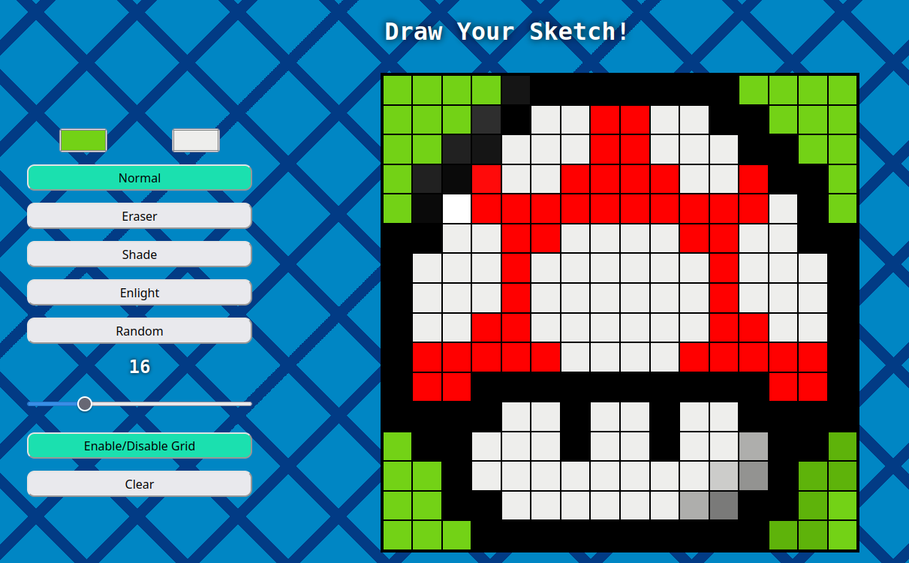
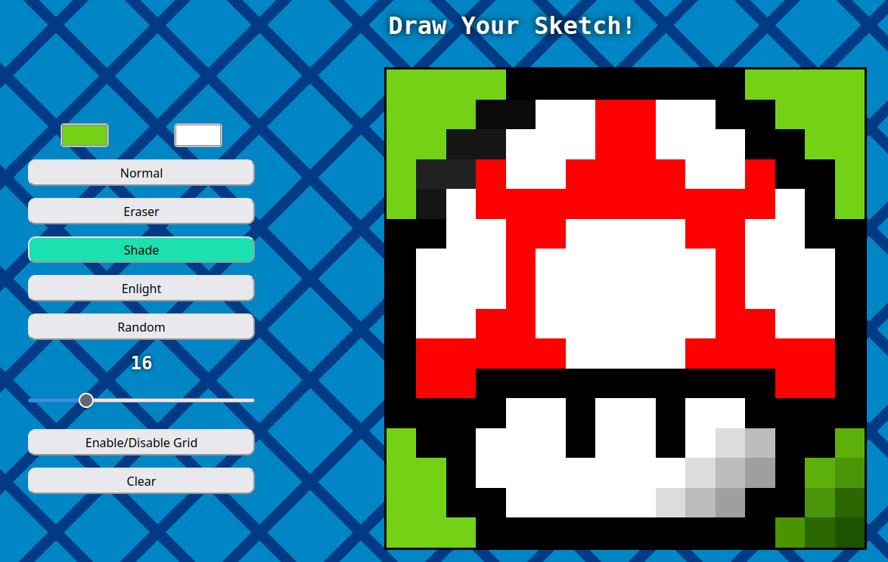

Creating a project with HTML, CSS and JavaScript to manipulate de DOM.

# Etch a Sketch

 - Draw your pixeled image!
 - Cellphone support!
 - Animated background in big screens!
 - Have some fun!

 
 

 ## Learnings

  - In this project, i have to learn a certain amount of events and selectors;
  - Pick a color and process it to shade it and enlight;
  - Change, read and create DOM elements with JavaScript;
  - Use @media for cellphone and @keyframes for background;
  - Training program logic with some pen options;

 